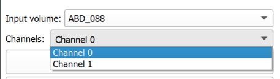
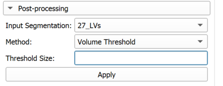
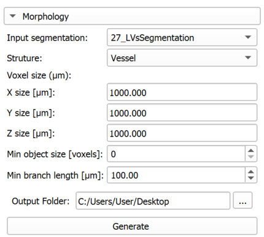
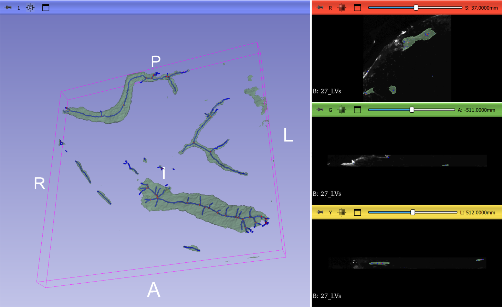
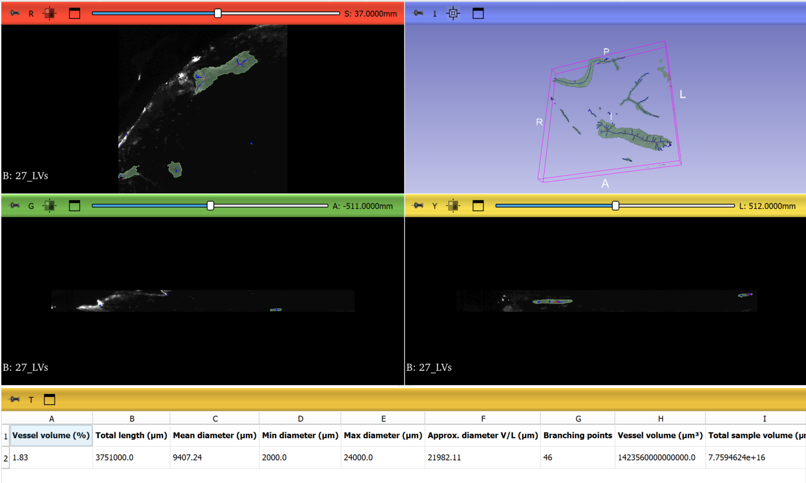

# Slicer nnUNet

This repository extends the original Slicer nnUNet module with additional workflow tools for channel inspection, segmentation post-processing, and vessel morphology analysis inside 3D Slicer.

If you want the baseline module documentation, installation context, and the original usage notes, start with [OLD_README.md](OLD_README.md). This README focuses on the current state of this fork and the code changes that have been added on top of the original extension.

## Table of Contents

- [Overview](#overview)
- [What Changed in This Fork](#what-changed-in-this-fork)
- [Current Workflows](#current-workflows)
- [Morphology Outputs](#morphology-outputs)
- [Expected Weight Folder Structure](#expected-weight-folder-structure)
- [Acknowledgments](#acknowledgments)
- [Contributing](#contributing)

## Overview

The module allows you to:

- install nnUNet inside 3D Slicer's Python environment
- run inference from a trained nnUNet model folder
- inspect channels from multi-channel image inputs
- post-process segmentation outputs
- compute vessel morphology measurements from a segmentation
- generate skeleton and branchpoint visualizations as Slicer segmentation nodes

The main workflows are exposed directly in the module widget:

- `nnUNet Install`
- `nnUNet Run Settings`
- `Post Processing`
- `Morphology`

## What Changed in This Fork

Compared with the original extension, this fork adds the following user-facing functionality.

### 1. Multi-channel input inspection

The module now detects when the selected input volume contains multiple channels and exposes a `Channels` selector in the widget.

What it does:

- loads the selected volume with `nibabel` when possible
- detects whether the input is 4D
- lets the user preview individual channels in the Slicer slice viewers

Important note:

- this feature is a visualization aid for inspecting the selected input volume before inference
- it does not create a new segmentation mode or a separate channel-processing pipeline

### 2. Segmentation post-processing

The module now includes a `Post Processing` section for cleaning segmentation results after inference.

Currently implemented:

- `Volume Threshold`

Behavior:

- connected components smaller than the user-defined threshold are removed
- the cleaned result is imported back into the scene as a new segmentation node

Implementation note:

- the threshold is applied in voxel count using connected-component labeling

### 3. Morphology analysis workflow

The module now includes a dedicated `Morphology` section for vessel-oriented analysis of a selected segmentation.

The current implementation supports:

- selecting a segmentation node as morphology input
- automatic pre-filling of spacing fields from segmentation geometry
- manual override of voxel spacing in `um`
- optional removal of small connected components using `Min object size [voxels]`
- optional pruning of short terminal branches using `Min branch length [um]`
- CSV export of morphology metrics
- automatic loading of the exported metrics table back into Slicer
- creation of visualization segmentations for the vessel skeleton and branch points

Important implementation details reflected in the code:

- morphology spacing is derived from the selected segmentation geometry, not from the current reference volume
- segmentation export for morphology uses the segmentation's own geometry when converting to a labelmap
- branchpoint counting is performed on the pruned skeleton
- skeleton and branchpoint visualization masks are dilated for easier viewing in 3D
- previous morphology visualization nodes with the same generated names are removed before new ones are created

## Current Workflows

### Install nnUNet

Use the `nnUNet Install` section to install nnUNet in Slicer's Python environment.

The widget shows the currently installed nnUNet version. If no version is installed, it displays `None`.

You can:

- leave `To install` empty to install the default/latest supported package version
- specify a version suffix before clicking `Install`

After installation, a Slicer restart may be required before inference can run.

### Run inference

Open `nnUNet Run Settings`, choose the trained model folder, select the input volume, and click `Apply`.

The current run settings exposed in the UI are:

- model path
- device selection: `cuda`, `cpu`, or `mps`
- step size
- checkpoint name
- folds
- preprocessing process count
- segmentation export process count
- disable test-time augmentation

When inference finishes:

- the segmentation is loaded into the Slicer scene
- the segmentation is renamed from the input volume name
- the new segmentation is automatically selected as the default input for the morphology workflow

### Post-process a segmentation

Use the `Post Processing` section to apply cleanup to an existing segmentation node.

At this time, the only exposed method is `Volume Threshold`, which removes connected components smaller than a chosen voxel threshold.

### Run morphology analysis

Use the `Morphology` section to analyze a segmentation and export measurements.

The workflow is:

1. Select the segmentation node to analyze.
2. Review or override the `X`, `Y`, and `Z` voxel size fields in `um`.
3. Optionally set `Min object size [voxels]`.
4. Optionally set `Min branch length [um]`.
5. Choose an output folder.
6. Click `Generate`.

The module then:

- computes morphology metrics
- writes them to `MorphologyMetrics.csv`
- loads the CSV as a table in Slicer
- creates a skeleton segmentation node
- creates a branchpoint segmentation node
- updates 3D display visibility and opacity for the original segmentation and generated outputs

## Morphology Outputs

The current morphology metrics exported by the code are:

- `Vessel volume (%)`
- `Total length (um)`
- `Mean diameter (um)`
- `Min diameter (um)`
- `Max diameter (um)`
- `Approx. diameter V/L (um)`
- `Branching points`
- `Vessel volume (um^3)`
- `Total sample volume (um^3)`

The generated visualization outputs are:

- a blue segmentation named with the `_Skeleton` suffix
- a red segmentation named with the `_Branchpoints` suffix

These outputs are created from the selected segmentation geometry so they align with the analyzed segmentation in Slicer. Below is an example from the dataset used to develop the extension

## Expected Weight Folder Structure

To run nnUNet inference, the model weight folder structure must be preserved.

Expected structure:

- `<dataset_id>`
- `<trainer_name>__<plan_name>__<config_name>`
- `fold_<n>`
- `checkpoint_final.pth` or another checkpoint file name configured in the module
- `dataset.json`

Notes:

- the dataset folder name must either begin with `Dataset` or be an integer id
- the configuration folder name must split into exactly three parts using `__`
- requested folds must exist and contain the selected checkpoint file

If this structure is not preserved, validation fails and inference cannot run.

The `Parameter` class contains the model-path validation logic used by the module.

For general nnUNet model structure guidance, see the [official nnUNet documentation](https://github.com/MIC-DKFZ/nnUNet/blob/master/documentation/how_to_use_nnunet.md#3d-u-net-cascade).

## Acknowledgments

This fork was developed with funding and support from ETH Zurich.

## Contributing

Contributions are welcome. For general Slicer contribution practices, see the [Slicer CONTRIBUTING.md](https://github.com/Slicer/Slicer/blob/main/CONTRIBUTING.md).
